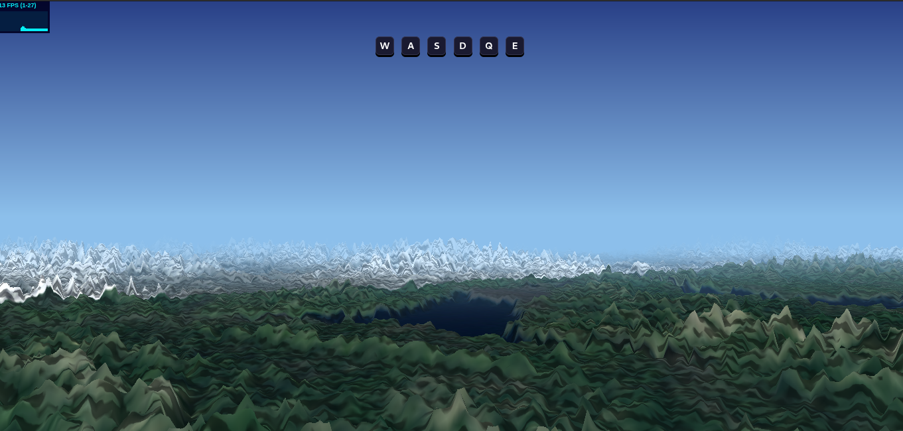
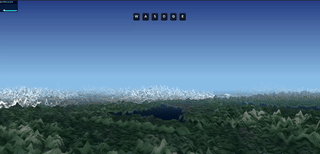

# Voxel Terrain R3F

A Voxel Space terrain renderer built with React Three Fiber, implementing the classic voxel terrain rendering algorithm.



## Getting Started

```bash
npm install
npm run dev
```

## Controls

| Key | Action |
|-----|--------|
| W | Fly forward |
| S | Fly backward |
| A | Turn left |
| D | Turn right |
| Q | Increase altitude |
| E | Decrease altitude |

## How It Works

The Voxel Space algorithm renders terrain using height maps and color maps:
- **Height Map**: Grayscale image where pixel brightness = terrain elevation
- **Color Map**: RGB image with pre-baked terrain colors, textures, and shadows

The renderer casts rays from the camera into the world, marching from near to far. Each terrain sample is projected onto the screen, and only pixels above the highest previously drawn point are rendered (front-to-back rendering with occlusion).

See [DOCS/VOXEL_SPACE_ALGORITHM.md](DOCS/VOXEL_SPACE_ALGORITHM.md) for detailed algorithm documentation.

## Generating Terrain Maps

Use AI image generators (like nano-banana) to create height and color map pairs. See `DOCS/VOXEL_SPACE_ALGORITHM.md` for optimized prompts.

## Demo



## Tech Stack

- React + Vite
- React Three Fiber
- Custom GLSL shaders
